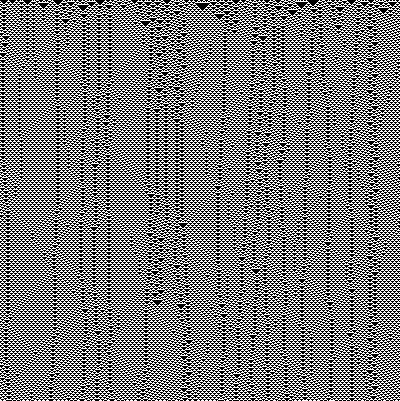
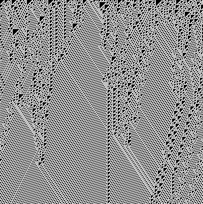
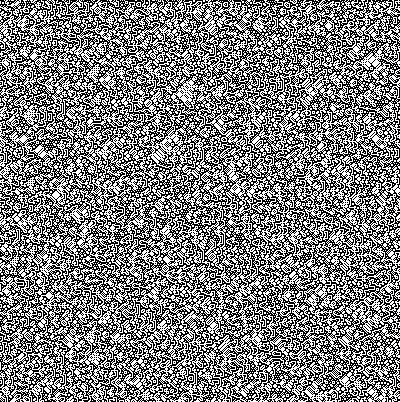
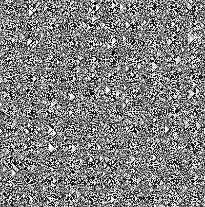
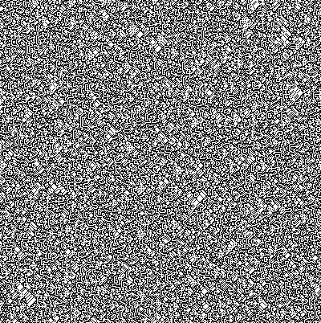
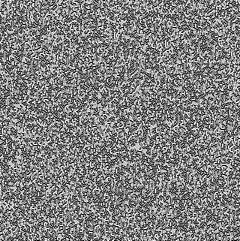
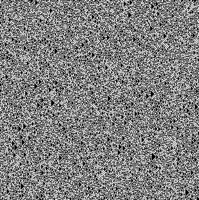
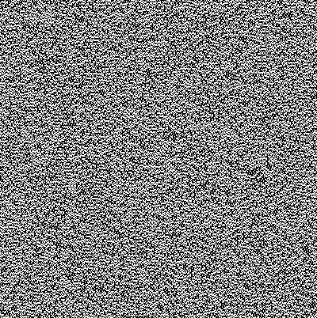
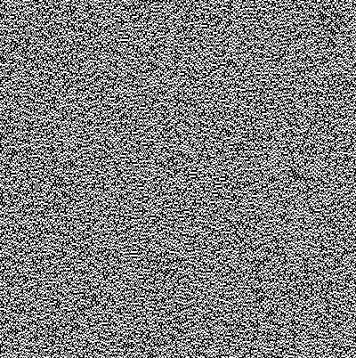

# mecacipher

A chaos-based, metamorphic block cipher based on second-order cellular automata (MECA).

* Fully templated to accomodate block-sizes of up to 256 bits (64/128/256 bits have been tested)
* Key size of up to 255 bytes
    * Metamorphically evolved key schedule using globally chaotic (class 4) rules of elementary CA (irreversible)
* Metamorphic engine to select second-order rules to evolve based on incoming data
* Configurable rounds for added security

## Key Schedule

The key schedule has been adapted from RC6's algorithm, you will find it using the same magic
constants with 4 less words if the number of desired keys is greater than the key generating
key length.

**Magic constants**

* Let P = the binary expansion of Euler's number - 2

* Let Q = the binary expansion of the golden ratio - 1

The schedule is initialized with the first element set to P. The rest of the schedule is initialized 
additively using the previous key + Q. For 3 * max(key length, num_keys) iterations, the keys XORed 
with the key-generating-key and metamorphically evolved using irreversible class 4 elementary cellular 
automata rules (54, 110, and 137).

### Rule 54



### Rule 110



### Rule 137


## Metamorphic Engine

The metamorphic engine selects rules for the second-order automata given the state of the
CA during a given encryption/decryption round. These rules have been selected based on their
sensitivity to initial conditions and differential cryptanalysis (see *Cryptographic 
Properties of Second-Order Memory Elementary Cellular Automata*)

### Rule 75



### Rule 86



### Rule 89



### Rule 149



### Rule 166



### Rule 173



### Rule 229




## Output

Configured for 15 rounds with 128-bit block size

```
plaintext: 00001337 00001337 00001337 00001337
key      : 4d792063 72696d65 20697320 74686174 206f6620 63757269 6f736974 79000000
encrypted: 09caccda d1c7bf5a 30d6a330 89ceacc6
decrypted: 00001337 00001337 00001337 00001337
enc time : 46 microseconds
dec time : 43 microseconds
```

Configured for 15 rounds with 256-bit block size

```
plaintext: 0000000000001337 0000000000001337 0000000000001337 0000000000001337
key      : 4d79206372696d65 2069732074686174 206f662063757269 6f73697479000000
encrypted: f93c3f9aa190830e 26cc1764f2b1e672 fce9cc8a79d8a855 1425184e184832b8
decrypted: 0000000000001337 0000000000001337 0000000000001337 0000000000001337
enc time : 86 microseconds
dec time : 81 microseconds
```

## Future plans

- [ ] Metamorphic engine for key scheduling (xor, add, subtract, invert, etc)

## References

- [Second-order cellular automaton](https://en.wikipedia.org/wiki/Second-order_cellular_automaton)
- [Cryptographic Properties of Second-Order Memory Elementary Cellular Automata](https://ieeexplore.ieee.org/document/4529417)
- [The Stone Cipher-192 (SC-192): A Metamorphic Cipher](https://d1wqtxts1xzle7.cloudfront.net/6257923/091101.pdf?response-content-disposition=inline%3B+filename%3DThe_Stone_Cipher_192_SC_192_A_Metamorphi.pdf&Expires=1643938338&Signature=Z5HpehmixBvYedndmkNJ6IQdIQLpCk7eLcD~eqX-UDlNSM03D60Zy9YW2CxCXydjIdlI-DVbKAdFhQWl~usaCJ-YSdUOJksu6qqkdhZdFRCXiqNw9H4288llkFoei9Pg50O8kAux-6-hZYmtBr0UwiRdW3Y-4~-75oHrYi4woJc8oJRX7I8qTB1V2b7Xzfu8P51fX9SXhEZcRP0PMyQHMh-Gd0dDexAKkjAAi3~1qtbfLtHaSaPX5DS5xEFieYsVUPrmF3-NP2~dibit2EC3rljetMfrSKKsWg7A5z9MOFGnTTATUNmeOqSg7wKFlrmu2QnRE-vlrchGJY9uhVc9KA__&Key-Pair-Id=APKAJLOHF5GGSLRBV4ZA)
