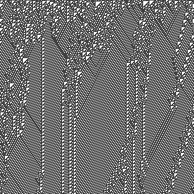

# mecacipher

A chaos-based, metamorphic block cipher based on second-order cellular automata (MECA).

* Fully templated to accomodate block-sizes of up to 256 bits (64/128/256 bits have been tested)
* Key size of up to 255 bytes
    * Metamorphically evolved key schedule using globally chaotic (class 4) rules of elementary CA (irreversible)
* Metamorphic engine to select second-order rules to evolve based on incoming data
* Configurable rounds for added security

## Key Schedule

The key schedule has been adapted from RC6's algorithm, you will find it using the same magic
constants with 4 less words if the number of desired keys is greater than the key generating
key length.

**Magic constants**

* Let P = the binary expansion of Euler's number - 2

* Let Q = the binary expansion of the golden ratio - 1

The schedule is initialized with the first element set to P. The rest of the schedule is initialized 
additively using the previous key + Q. For 3 * max(key length, num_keys) iterations, the keys XORed 
with the key-generating-key and metamorphically evolved using irreversible class 4 elementary cellular 
automata rules (54, 110, and 137).

### Rule 54


### Rule 110


### Rule 137



## Metamorphic Engine

The metamorphic engine selects rules for the second-order automata given the state of the
CA during a given encryption/decryption round. These rules have been selected based on their
sensitivity to initial conditions and differential cryptanalysis (see *Cryptographic 
Properties of Second-Order Memory Elementary Cellular Automata*)

### Rule 75


### Rule 86


### Rule 89


### Rule 149


### Rule 166


### Rule 173


### Rule 229


## Output

Configured for 15 rounds

**64-bit block size**

```
PLAINTEXT: 1337 1337 1337 1337
KEY      : 4d79 2063 7269 6d65 2069 7320 7468 6174 206f 6620 6375 7269 6f73 6974 7900
ENCRYPTED: ee1c fa14 68e1 51c8
DECRYPTED: 1337 1337 1337 1337
ENC TIME : 37 microseconds
DEC TIME : 33 microseconds
```

**128-bit block size**
```
PLAINTEXT: 00001337 00001337 00001337 00001337
KEY      : 4d792063 72696d65 20697320 74686174 206f6620 63757269 6f736974 79000000
ENCRYPTED: d93041ec e3fa5b94 01a2df58 71ca05ab
DECRYPTED: 00001337 00001337 00001337 00001337
ENC TIME : 47 microseconds
DEC TIME : 35 microseconds
```

**256-bit block size**
```
PLAINTEXT: 0000000000001337 0000000000001337 0000000000001337 0000000000001337
KEY      : 4d79206372696d65 2069732074686174 206f662063757269 6f73697479000000
ENCRYPTED: e72d26f7318d3da2 0ec874868d14ac9b 7d91e0e34ee12d46 0fd1e08f367ad342
DECRYPTED: 0000000000001337 0000000000001337 0000000000001337 0000000000001337
ENC TIME : 78 microseconds
DEC TIME : 61 microseconds
```

## Future plans

- [ ] Metamorphic engine for key-generating-key combination with key schedule (xor, add, subtract, invert, etc)

## References

- [Second-order cellular automaton](https://en.wikipedia.org/wiki/Second-order_cellular_automaton)
- [Cryptographic Properties of Second-Order Memory Elementary Cellular Automata](https://ieeexplore.ieee.org/document/4529417)
- [The Stone Cipher-192 (SC-192): A Metamorphic Cipher](https://d1wqtxts1xzle7.cloudfront.net/6257923/091101.pdf?response-content-disposition=inline%3B+filename%3DThe_Stone_Cipher_192_SC_192_A_Metamorphi.pdf&Expires=1643938338&Signature=Z5HpehmixBvYedndmkNJ6IQdIQLpCk7eLcD~eqX-UDlNSM03D60Zy9YW2CxCXydjIdlI-DVbKAdFhQWl~usaCJ-YSdUOJksu6qqkdhZdFRCXiqNw9H4288llkFoei9Pg50O8kAux-6-hZYmtBr0UwiRdW3Y-4~-75oHrYi4woJc8oJRX7I8qTB1V2b7Xzfu8P51fX9SXhEZcRP0PMyQHMh-Gd0dDexAKkjAAi3~1qtbfLtHaSaPX5DS5xEFieYsVUPrmF3-NP2~dibit2EC3rljetMfrSKKsWg7A5z9MOFGnTTATUNmeOqSg7wKFlrmu2QnRE-vlrchGJY9uhVc9KA__&Key-Pair-Id=APKAJLOHF5GGSLRBV4ZA)
